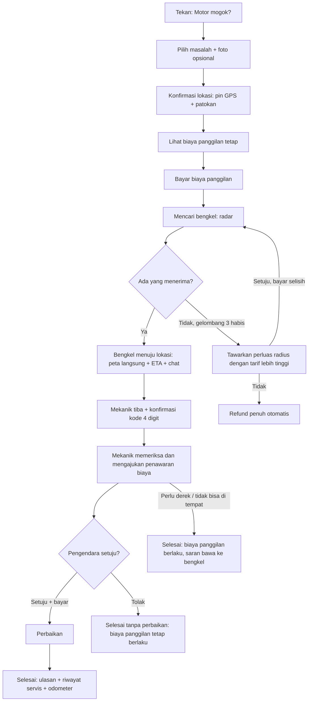

# PRD Update v1.3 — Chat, Bantuan Darurat (Motor Mogok), dan Fitur MVP Tambahan

| | |
|---|---|
| **Versi** | 1.3 (menambah PRD v1.2; tidak mengganti isinya) |
| **Tanggal** | 3 Oktober 2026 |
| **Platform** | Flutter (Android 8.0+ / iOS 15+), backend Supabase (Postgres, Realtime, Edge Functions) |
| **Prototype UI + animasi** | `design/prototype/bengkelku-update-v1.3.html` (6 layar, terang/gelap, tombol ulang animasi) |
| **Efek ke PRD v1.2** | Bagian 6 "Di Luar Lingkup": *chat in-app*, *panggilan darurat* dan *servis panggilan ke lokasi* **dipindah ke dalam MVP**. *Tambahan pekerjaan* (FR-P8) naik dari P1 ke **P0** karena dipakai alur darurat |

Angka bertanda **(usulan)** adalah nilai bawaan sementara. Semuanya disimpan di `app_config` agar bisa diubah admin tanpa rilis. Daftar keputusan terbuka ada di Bagian 12.

---

## 1. Ringkasan

| # | Fitur | Prioritas | Alasan |
|---|---|---|---|
| A | **Chat pengendara ↔ bengkel** (per booking dan per panggilan darurat) | P0 | Mengurangi telepon di luar platform, bukti kesepakatan, menjawab pertanyaan sebelum datang |
| B | **Bantuan Darurat: bengkel datang ke lokasi motor mogok** (biaya panggilan + jarak) | P0 | Kebutuhan paling mendesak pengendara; pembeda kuat; sumber pendapatan baru |
| C | **Penawaran biaya perbaikan di tempat** (bengkel mengajukan, pengendara setujui, bayar di aplikasi) | P0 | Syarat alur B; sekaligus menutup FR-P8 (tambahan pekerjaan) untuk booking biasa |
| D | **Pengingat pajak STNK + servis berkala** | P1 | Memakai mesin pengingat oli yang sudah ada; menambah alasan membuka aplikasi |
| E | **Voucher dan kode referral** | P1 | Akuisisi bengkel dan pengendara saat peluncuran nasional |
| F | **Pusat bantuan dan laporan masalah** (sengketa transaksi, bengkel, mekanik) | P0 | Uang ditahan platform, jadi harus ada jalur komplain yang jelas |
| G | **Ekspor buku servis digital (PDF)** | P1 | Nilai jual motor bekas, bukti perawatan |

Yang **sengaja tidak masuk**: derek (towing) dan ambulans (Bagian 4.9), panggilan suara/video dalam aplikasi, pembayaran tunai (Bagian 12), penjualan sparepart.

---

## 2. Fitur A — Chat

### 2.1 Aturan

| Aturan | Ketentuan |
|---|---|
| Jenis thread | `booking` (dibuat saat pembayaran berhasil) dan `sos` (dibuat saat bengkel menerima panggilan darurat) |
| Peserta | Tepat 2: pengendara dan pemilik/staf bengkel yang menangani. Staf bengkel (P1) memakai thread yang sama |
| Kapan bisa mengirim | Booking: sejak `DIBAYAR_MENUNGGU_KONFIRMASI` sampai 7 hari setelah selesai/berakhir. Darurat: sejak diterima sampai 24 jam setelah selesai. Sesudah itu thread hanya-baca |
| Isi pesan | Teks (maks 1.000 karakter), foto (maks 3 per pesan, **maks 2 MB per foto**), pesan sistem (perubahan status), kartu penawaran (Fitur C), lokasi pengendara (hanya thread darurat) |
| Foto > 2 MB | Ditolak di klien dengan teks baku: **"ukuran media anda terlalu besar segera kompres file media untuk melanjutkan"**. Server menolak juga (batas bucket) |
| Penyaringan | Nomor telepon, tautan, dan alamat email diganti `[disembunyikan]` oleh trigger database (kebijakan sama dengan catatan penolakan booking, Handoff 6.9). Tujuannya mencegah transaksi di luar platform |
| Status pesan | Terkirim, dibaca (Realtime). Indikator "sedang mengetik" lewat Realtime Broadcast, tidak disimpan |
| Balasan cepat (bengkel) | "Sudah saya terima", "Saya berangkat ke lokasi", "Bisa kirim foto kerusakannya?", "Estimasi tiba {menit} menit" |
| Balasan cepat (pengendara) | "Saya sudah di lokasi", "Posisi tepatnya di seberang {…}", "Terima kasih" |
| Pesan pertama | Pengendara tidak bisa mengirim pesan ke bengkel yang belum menerima booking. Sebelum diterima, kolom input menampilkan "Chat terbuka setelah bengkel menerima booking-mu" |
| Notifikasi | Push `chat` untuk pesan baru (digabung bila > 3 pesan dalam 1 menit). Mengikuti kategori "Status booking dan pembayaran" di `notifSettings` |
| Laporkan / blokir | Tombol di menu thread. Laporan masuk antrean moderasi admin; admin hanya dapat membaca thread yang dilaporkan (tercatat di audit log) |
| Offline | Pesan masuk antrean lokal dan dikirim ulang otomatis dengan `client_id` (idempoten) |

### 2.2 Layar

| ID | Layar | Komponen |
|---|---|---|
| `chatList` | Daftar chat (tab di Booking atau ikon di Beranda dengan lencana) | `ChatThreadTile` (avatar bengkel, pesan terakhir, waktu, lencana belum dibaca, penanda "Darurat") |
| `chatRoom` | Ruang chat | `ChatBubble`, `SystemMessage`, `QuoteCard`, `TypingDots`, `QuickReplyRow`, `ChatComposer`, `BookingPinnedCard` (ringkasan booking di atas, ketuk membuka detail) |

### 2.3 Animasi chat (token gerak sama dengan Handoff bagian 2)

| Momen | Animasi |
|---|---|
| Pesan baru masuk | Naik 10 dp + fade, 250 ms `easeOut`; gelembung sendiri dari kanan dengan scale 0,96 → 1 |
| Status terkirim → dibaca | Centang berubah warna `blue` 250 ms (tanpa gerak berlebih) |
| Sedang mengetik | 3 titik melompat bergantian, siklus 1,2 dtk |
| Foto | Placeholder buram → tajam 300 ms setelah termuat |
| Balasan cepat dipilih | Chip menyusut ke kolom input 200 ms, lalu terkirim |
| Pesan sistem | Fade 200 ms, tanpa gerak |
| Kartu penawaran baru | Masuk dengan `spring` 400 ms + getar ringan sekali |

---

## 3. Fitur B — Bantuan Darurat (Motor Mogok)

### 3.1 Konsep

Pengendara yang motornya mogok menekan **"Motor mogok?"** (tombol tetap di Beranda dan Peta). Aplikasi mengambil lokasi, menampilkan **biaya panggilan yang tetap dan jelas sebelum bayar**, lalu menawarkan panggilan ke bengkel terdekat yang sedang *siaga darurat*. Bengkel pertama yang menerima mendatangi lokasi. Perbaikan di tempat ditawarkan lewat **penawaran biaya** (Fitur C). Bila tidak ada bengkel yang menerima, biaya panggilan dikembalikan penuh otomatis.

### 3.2 Alur pengendara



### 3.3 Alur pemilik bengkel

1. Pemilik mengaktifkan **"Siaga darurat"** di dasbor. Syarat: bengkel `DISETUJUI` dan aktif, minimal 1 mekanik tersedia, izin lokasi *Always* (Android: foreground service dengan notifikasi tetap; iOS: *background location*). Bengkel yang tutup menurut jam operasional tidak menerima panggilan kecuali mengaktifkan "Siaga di luar jam buka".
2. Tawaran masuk sebagai layar penuh + suara + getar: jarak, ETA, jenis masalah, foto, **pendapatan bersih** yang akan diterima, dan hitung mundur **60 detik**. Tombol **Terima** / **Lewati**.
3. Setelah terima: peta + navigasi ke lokasi, berbagi lokasi langsung ke pengendara tiap 5 detik, tombol "Saya sudah tiba".
4. Di lokasi: minta **kode 4 digit** dari pengendara (bukti kehadiran), periksa motor, ajukan penawaran (Fitur C) atau selesai tanpa perbaikan.
5. Selesai: isi riwayat servis dan odometer (aturan yang sama dengan FR-O1..O3). Dana masuk alur payout H+1.

### 3.4 Pencocokan (dispatch)

| Aspek | Ketentuan |
|---|---|
| Kandidat | `DISETUJUI`, aktif, `emergency_ready = true`, lokasi terakhir ≤ 60 detik, jarak lurus ≤ radius tier, belum menolak/melewatkan permintaan ini |
| Urutan | ETA perkiraan (jarak ÷ 25 km/jam sebagai nilai awal), lalu rating, lalu tingkat penerimaan |
| Gelombang | Gelombang 1: 3 bengkel terdekat bersamaan, 60 detik. Gelombang 2: 3 berikutnya. Gelombang 3: 3 berikutnya. Total maks 3 menit 30 detik |
| Pemenang | **Yang pertama menerima.** Penerimaan atomik (`FOR UPDATE SKIP LOCKED` + pengecekan status); penerima lain mendapat "Panggilan sudah diambil" |
| Kosong | Setelah gelombang 3: tawarkan tier berikutnya (lebih jauh, lebih mahal) atau refund penuh otomatis |
| Tingkat penerimaan | Dicatat per bengkel. Bengkel yang sering melewatkan (ambang `sos_min_accept_rate`) turun urutan dan diberi tahu |
| Batas | Satu panggilan aktif per pengendara. Satu panggilan aktif per bengkel (MVP: satu mekanik lapangan per bengkel) |

### 3.5 Biaya (usulan, semua di `app_config`)

Tarif ditentukan oleh **tier jarak ke bengkel terdekat yang siaga saat permintaan dibuat**. Tawaran hanya dikirim ke bengkel yang berada di dalam tier itu atau lebih dekat, sehingga harga yang ditampilkan **tidak bisa naik** setelah dibayar.

| Tier | Jarak bengkel ke pengendara | Biaya panggilan |
|---|---|---|
| 1 | ≤ 3 km | Rp 25.000 |
| 2 | > 3 sampai 6 km | Rp 40.000 |
| 3 | > 6 sampai 10 km | Rp 55.000 |
| 4 | > 10 sampai 15 km | Rp 75.000 |

| Komponen | Ketentuan |
|---|---|
| Biaya malam | +Rp 10.000 pukul 21.00–05.00 waktu lokasi pengendara |
| Biaya layanan platform untuk pengendara | Mengikuti `user_service_fee` (bawaan Rp 0) |
| Komisi | 8% dari biaya panggilan dan dari penawaran perbaikan (`commission_rate` yang disalin ke permintaan saat dibuat) |
| Pembayaran | Biaya panggilan **dibayar di muka** lewat gateway (QRIS/e-wallet/VA), batas bayar 10 menit, dana ditahan platform |
| Perbaikan di tempat | Dibayar lewat aplikasi setelah penawaran disetujui (tidak ada tunai di MVP) |
| Contoh | Bengkel di 2,4 km, siang → Rp 25.000. Mekanik mengajukan ganti aki Rp 185.000 → pengendara membayar Rp 185.000 → bengkel menerima (25.000 + 185.000) − 8% = **Rp 193.200** |

### 3.6 Pembatalan dan refund

| Kondisi | Biaya panggilan |
|---|---|
| Belum ada bengkel yang menerima | Refund 100% |
| Pengendara batal ≤ 2 menit setelah diterima, mekanik belum bergerak > 300 m | Refund 100% |
| Pengendara batal setelah mekanik menuju lokasi | Refund 50%; 50% diberikan ke bengkel sebagai ganti waktu dan bahan bakar |
| Mekanik batal / tidak muncul (ETA lewat > 15 menit tanpa pergerakan) | Refund 100% + pencatatan ke skor bengkel; pengendara ditawari pencarian ulang tanpa biaya ulang |
| Mekanik tiba, pengendara tidak ada di lokasi (> 10 menit) | Tidak ada refund; bengkel menerima biaya panggilan |
| Mekanik tiba, motor tidak bisa diperbaiki di tempat | Biaya panggilan berlaku; sistem menyarankan bawa ke bengkel (booking biasa) |

### 3.7 Status permintaan darurat

```
MENUNGGU_PEMBAYARAN ──bayar──▶ MENCARI_BENGKEL ──ada yang terima──▶ DITERIMA ──mekanik bergerak──▶ MENUJU_LOKASI
        │                            │                                    │                              │
   (10 mnt) ▼                (habis semua gelombang) ▼                 (batal) ▼                  (tiba + kode) ▼
    KEDALUWARSA              TIDAK_ADA_BENGKEL + REFUND                DIBATALKAN                        TIBA
                                                                                                          │
                                                       penawaran disetujui ◀─── MEMERIKSA ◀──────────────┘
                                                              │                    │
                                                              ▼                    ▼ (tolak / tak bisa)
                                                          DIKERJAKAN ──▶ SELESAI   SELESAI_TANPA_PERBAIKAN
```

### 3.8 Keamanan dan privasi

| Risiko | Kontrol |
|---|---|
| Lokasi pengendara dibagikan ke bengkel yang salah | Lokasi tepat hanya dibuka ke bengkel pemenang. Penawaran ke bengkel lain hanya menampilkan jarak dan area umum (dibulatkan 300 m) |
| Pelacak mekanik disalahgunakan | Lokasi mekanik hanya terlihat oleh pengendara terkait, hanya saat status `MENUJU_LOKASI` sampai `TIBA`, lalu berhenti |
| Orang lain mengaku mekanik | Kartu mekanik: foto, nama bengkel, plat motor, **kode 4 digit** yang diminta mekanik dari pengendara saat tiba |
| Bahaya jalan | Layar permintaan menampilkan saran singkat: nyalakan lampu hazard, menepi, jangan berdiri di badan jalan |
| Kecelakaan / luka | Fitur ini **bukan layanan medis**. Tombol tetap "Kecelakaan atau luka? Telepon 112" membuka dialer |
| Penipuan harga di lokasi | Semua biaya di luar biaya panggilan wajib lewat penawaran di aplikasi; chat menyaring nomor/tautan; laporan masuk antrean admin |
| Pemalsuan lokasi (mock GPS) | Server membandingkan akurasi dan lompatan jarak; tanda mencurigakan dikirim ke antrean admin |
| Penyalahgunaan (panggilan palsu) | Batas 5 permintaan batal tanpa alasan per 30 hari, lalu fitur ditahan 7 hari |

### 3.9 Layar

| ID | Layar | Komponen utama |
|---|---|---|
| `sosEntry` | Tombol "Motor mogok?" (Beranda, Peta) | `SosButton` |
| `sosForm` | Masalah, lokasi, biaya | `ProblemChip` ×6, `LocationConfirmCard`, `FeeBreakdown`, `AppButton` |
| `sosPay` | Bayar biaya panggilan | Memakai `payment` yang sudah ada (batas 10 menit) |
| `sosSearching` | Mencari bengkel | `RadarPulse`, `WaveProgress` (gelombang 1–3), tombol Batalkan |
| `sosTracking` | Mekanik menuju lokasi | `LiveMap`, `MechanicCard`, `EtaPill`, tombol Chat, `ArrivalCodeCard` |
| `sosQuote` | Penawaran biaya | `QuoteCard`, `PriceRows`, tombol Setujui dan bayar / Tolak |
| `sosDone` | Selesai | `SuccessBurst`, ringkasan, `StarRatingInput` |
| `sosNoShop` | Tidak ada bengkel | Ilustrasi, tombol "Perluas pencarian" dan "Batalkan dan refund" |
| `ownerSosOffer` | Tawaran masuk (bengkel) | `OfferCountdown`, `EarningsPill`, Terima / Lewati |
| `ownerSosRoute` | Menuju lokasi (bengkel) | Peta, tombol navigasi (Google Maps/Waze), "Saya sudah tiba", input kode 4 digit |
| `ownerQuoteForm` | Susun penawaran | Daftar butir + harga, total, catatan, foto bukti |
| `ownerStandby` | Pengaturan siaga darurat | `AppSwitch`, radius, jam siaga |

### 3.10 Animasi darurat

| Momen | Animasi |
|---|---|
| Tombol "Motor mogok?" | Denyut halus `warnC` (scale 1 → 1,06, 2,4 dtk, loop); tekan: scale 0,96 + haptic sedang |
| Lokasi dikonfirmasi | Pin jatuh `spring` 600 ms; cincin akurasi mengembang lalu mengecil mengikuti akurasi GPS |
| Rincian biaya | Angka hitung naik 600 ms; baris malam muncul dengan slide-in bila berlaku |
| Mencari bengkel | Radar 3 cincin 2,6 dtk; titik bengkel muncul berurutan per gelombang (selang 260 ms); `WaveProgress` terisi per gelombang |
| Bengkel menerima | Radar menyusut ke pin, kartu mekanik naik `spring` 500 ms, getar ringan |
| Mekanik bergerak | Marker bergerak halus (interpolasi 5 dtk antar titik, bukan melompat), garis rute terisi mengikuti sisa jarak, ETA berubah dengan transisi angka 300 ms |
| Mekanik tiba | Cincin hijau berdenyut di marker, kartu kode 4 digit memantul sekali |
| Tawaran bengkel (sisi bengkel) | Layar naik penuh 350 ms; cincin hitung mundur 60 dtk menyusut linear, merah pada 10 dtk terakhir; tombol Terima berdenyut |
| Tidak ada bengkel | Ikon radar redup, judul dan kartu naik berurutan (`dStagger`) |
| Reduce motion | Semua denyut dan gerak marker diganti perubahan instan atau fade 100 ms |

---

## 4. Fitur C — Penawaran Biaya (Quote)

### 4.1 Aturan

| Aturan | Ketentuan |
|---|---|
| Pengaju | Bengkel, setelah status `TIBA` (darurat) atau `DIKERJAKAN` (booking biasa, menggantikan FR-P8) |
| Isi | 1–10 butir: nama, jenis (`jasa` / `sparepart`), harga; catatan; foto bukti (maks 3, ≤ 2 MB) |
| Batas | Total maks Rp 2.000.000 per penawaran (usulan, `quote_max_total`); lebih dari itu wajib diselesaikan sebagai booking biasa |
| Berlaku | 10 menit (darurat), 30 menit (booking biasa). Lewat itu penawaran kedaluwarsa dan bengkel dapat mengajukan ulang |
| Persetujuan | Pengendara **Setujui dan bayar** atau **Tolak**. Tanpa persetujuan bengkel tidak boleh mengerjakan tambahan; total tidak boleh naik tanpa penawaran baru |
| Pembayaran | Lewat gateway, dana ditahan sampai pekerjaan ditandai selesai, lalu masuk batch payout H+1 |
| Sengketa | Pengendara dapat melapor dalam 24 jam setelah selesai (Fitur F); payout bagian itu ditahan selama sengketa |
| Revisi | Maks 2 revisi per permintaan; tiap revisi membatalkan penawaran sebelumnya |

### 4.2 Layar

`sosQuote` (pengendara), `ownerQuoteForm` (bengkel), dan kartu penawaran di chat (`QuoteCard`). Pada booking biasa, kartu yang sama muncul di `bookings`.

---

## 5. Fitur D — Pengingat Pajak STNK dan Servis Berkala (P1)

- Pengendara mengisi **tanggal jatuh tempo pajak tahunan** dan **tanggal STNK 5 tahunan** per motor (tanpa integrasi data samsat di MVP).
- Notifikasi H-30, H-7, H-1, hari H, memakai mesin `oil_reminders` yang sudah ada (tipe `service_due`) dan teks yang konsisten dengan Handoff 6.11. CTA: tautan informasi resmi pajak daerah (tautan dikelola di `app_config`).
- Servis berkala (rantai/CVT, kampas rem, busi, filter udara) memakai preset yang dikelola admin; **angka interval belum ditentukan** dan harus divalidasi dengan mekanik dan buku manual.
- Animasi: kartu pengingat di Garasi masuk dengan stagger, gauge/penghitung hari terisi 800 ms.

## 6. Fitur E — Voucher dan Referral (P1)

- Kode voucher: potongan persen atau nominal, kuota, masa berlaku, kategori (booking, darurat), minimal belanja. **Voucher dibiayai platform**: bengkel tetap menerima nilai penuh dikurangi komisi dari harga sebelum voucher.
- Referral pengendara: kode unik; kedua pihak mendapat voucher setelah teman menyelesaikan booking pertama.
- Referral bengkel (mengisi FR-L12 "Undang bengkel langganan"): bonus komisi 0% untuk 1 bulan setelah bengkel yang diundang disetujui. **Angka perlu persetujuan bisnis.**
- Pencegahan abuse: satu voucher per akun per kampanye, tautkan ke nomor HP terverifikasi, batas klaim per perangkat.
- Animasi: kartu voucher melipat-buka (flip 400 ms); penerapan kode menurunkan total dengan hitung turun 600 ms.

## 7. Fitur F — Pusat Bantuan dan Laporan Masalah (P0)

| Elemen | Ketentuan |
|---|---|
| Titik masuk | Profil > Bantuan; tombol "Laporkan masalah" di detail booking, panggilan darurat, dan chat |
| Kategori | Bengkel tidak datang, harga tidak sesuai, kerusakan setelah servis, refund belum masuk, perilaku tidak pantas, lainnya |
| Isi | Kategori, deskripsi (maks 1.000 karakter), foto (maks 3, ≤ 2 MB) |
| Status | `DITERIMA`, `DITINJAU`, `MENUNGGU_INFO`, `SELESAI` dengan keputusan dan alasan |
| Efek | Laporan harga/kerusakan menahan payout bagian terkait; admin memutuskan refund sebagian/penuh dari halaman Transaksi (admin web) |
| SLA | Balasan pertama ≤ 1×24 jam kerja (usulan) |
| FAQ | Artikel statis dikelola di `app_config` (judul, isi Markdown) |

## 8. Fitur G — Ekspor Buku Servis (P1)

PDF 1–3 halaman per motor: identitas motor, riwayat servis (tanggal, odometer, jenis, bengkel), penanda "dicatat bengkel terverifikasi". Dibuat di Edge Function, disimpan di bucket privat 24 jam, dibagikan lewat *share sheet* OS. Animasi: kertas "keluar" dari ikon dokumen 500 ms.

---

## 9. Model Data (tambahan)

Ditulis ringkas; migrasi SQL lengkap dikerjakan sesuai `docs/TASKS_V13.md`.

| Tabel | Kolom kunci |
|---|---|
| `chat_threads` | id, type (`booking`/`sos`), booking_id?, sos_request_id?, rider_id, workshop_id, state (`open`/`readonly`), last_message_at, rider_unread, workshop_unread |
| `chat_messages` | id, thread_id, sender_id, kind (`text`/`image`/`system`/`quote`/`location`), body, media_paths[], quote_id?, client_id (unik per thread), created_at, read_at |
| `chat_reports` | id, thread_id, reporter_id, reason, state, resolved_by |
| `sos_requests` | id, code, rider_id, status, problem_code, problem_note, photos[], lat, lng, accuracy_m, landmark, tier, call_fee, night_fee, service_fee, total, commission_rate, payment_expires_at, accepted_workshop_id?, accepted_at, arrived_at, arrival_code, wave, ended_reason, refund_percent, created_at |
| `sos_offers` | id, request_id, workshop_id, wave, distance_m, eta_min, state (`sent`/`accepted`/`skipped`/`expired`/`taken`), sent_at, expires_at |
| `sos_tracking` | request_id, workshop_id, lat, lng, speed, heading, recorded_at (hanya baris terakhir + jejak 24 jam; dihapus berkala) |
| `workshop_standby` | workshop_id, emergency_ready, after_hours, radius_tier_max, last_lat, last_lng, last_seen_at, accept_rate |
| `quotes` | id, booking_id?, sos_request_id?, workshop_id, items jsonb, total, state (`sent`/`approved`/`rejected`/`expired`/`superseded`), expires_at, revision, approved_at |
| `vouchers`, `voucher_redemptions`, `referrals` | Fitur E |
| `support_tickets`, `support_messages` | Fitur F |
| `vehicle_documents` | vehicle_id, kind (`pajak`/`stnk`), due_date, Fitur D |

**Realtime:** `chat_messages` (postgres changes, difilter `thread_id`), Broadcast untuk mengetik, `sos_requests` (status), `sos_tracking` (Broadcast channel `sos:{id}`, tidak ke tabel setiap 5 dtk; simpan ke tabel tiap 30 dtk).

**RLS (ringkas):** thread dan pesan hanya bisa dibaca peserta; insert pesan hanya bila `state = 'open'` dan pengirim peserta; `sos_requests` dibaca pengendara pemilik dan bengkel penerima; `sos_offers` dibaca bengkel tujuan; `sos_tracking` dibaca pengendara pemilik; tulis ke `sos_*` dan `quotes` hanya lewat RPC.

**RPC/Edge Functions baru:** `sos_quote_fee(lat,lng)`, `sos_create(...)`, `sos_dispatch_wave` (cron tiap 10 dtk), `sos_accept(offer_id)`, `sos_mark_arrived(code)`, `sos_cancel(...)`, `quote_create/approve/reject`, `chat_send` (menyaring isi, menghitung unread), `create-payment` diperluas untuk `sos_request_id`, `export-service-book`.

**Biaya kuota Supabase gratis:** Realtime gratis dibatasi (koneksi bersamaan dan pesan per bulan). Kurangi dengan: lokasi mekanik via Broadcast (tidak ditulis ke database), hanya satu channel per layar aktif, jeda 5 detik. Pantau di Dashboard; naik ke Pro bila mendekati batas.

---

## 10. Dampak ke Admin Web (proyek `02-bengkelku-admin-web`)

| Halaman | Penambahan |
|---|---|
| Konfigurasi | Tier tarif darurat, biaya malam, `quote_max_total`, durasi gelombang, `sos_min_accept_rate` |
| Pemantauan | Daftar permintaan darurat aktif (status, bengkel, usia), peringatan: > 3 menit tanpa penerima |
| Moderasi | Laporan chat (membaca thread terlapor, tercatat di audit log), tiket bantuan |
| Transaksi | Refund sebagian untuk sengketa penawaran; filter tipe `sos` |
| Laporan | Jumlah panggilan, rasio diterima, waktu rata-rata sampai diterima, waktu rata-rata sampai tiba |
| Voucher | CRUD voucher, laporan penebusan |

---

## 11. Metrik, Event Analitik, dan Kriteria Selesai

| Metrik | Target 3 bulan |
|---|---|
| Panggilan darurat yang diterima bengkel | ≥ 70% |
| Waktu median sampai diterima | ≤ 90 detik |
| Waktu median sampai mekanik tiba | ≤ 25 menit |
| Penawaran disetujui | ≥ 60% |
| Booking dengan chat aktif (≥ 1 pesan) | ≥ 40% |
| Sengketa per 100 transaksi | ≤ 3 |

Event: `sos_start`, `sos_fee_shown{tier}`, `sos_paid`, `sos_wave{n}`, `sos_accepted{wave,eta}`, `sos_arrived`, `sos_cancelled{stage}`, `sos_no_shop`, `quote_sent`, `quote_approved/rejected/expired`, `chat_open`, `chat_send{kind}`, `chat_report`, `support_ticket_created{category}`, `voucher_applied`.

**Kriteria selesai:**
- [ ] Uji alur darurat penuh: bayar → cari → terima → lacak → tiba (kode) → penawaran → bayar → selesai → payout H+1
- [ ] Uji refund: tidak ada bengkel, batal sebelum/sesudah bergerak, mekanik tidak muncul, pengendara tidak ada di lokasi
- [ ] Dua bengkel menerima bersamaan: tepat satu menang, yang lain mendapat "sudah diambil"
- [ ] Harga yang dibayar tidak pernah lebih tinggi dari yang ditampilkan
- [ ] Lokasi pengendara tidak bocor ke bengkel yang tidak menang; lokasi mekanik berhenti setelah selesai
- [ ] Foto > 2 MB menampilkan teks baku di chat, penawaran, dan laporan
- [ ] Nomor telepon dan tautan di chat tersaring
- [ ] Animasi mengikuti Reduce motion; terang/gelap benar

---

## 12. Keputusan Terbuka (dengan nilai bawaan)

| # | Pertanyaan | Nilai bawaan sementara |
|---|---|---|
| 1 | Tarif tier, biaya malam, batas radius 15 km | Bagian 3.5 |
| 2 | Pembayaran tunai untuk perbaikan di tempat | **Tidak** di MVP (risiko penipuan harga dan komisi hilang); dapat dibuka P1 dengan komisi dibayar belakangan |
| 3 | Mekanik lapangan: satu per bengkel atau banyak | Satu per bengkel (staf bengkel P1 menambah) |
| 4 | Derek (towing) | Di luar MVP; mekanik menyarankan bawa ke bengkel |
| 5 | Kompensasi mekanik untuk pembatalan oleh pengendara | 50% biaya panggilan (Bagian 3.6) |
| 6 | Asuransi / tanggung jawab kerusakan saat perbaikan di jalan | Perlu nasihat hukum dan syarat dan ketentuan khusus sebelum rilis |
| 7 | Retensi isi chat dan jejak lokasi | Chat 12 bulan, jejak lokasi 24 jam **(placeholder, konfirmasi legal UU PDP)** |
| 8 | Izin lokasi latar belakang di iOS/Android untuk mekanik | Wajib; perlu justifikasi pada review toko aplikasi |
| 9 | Tarif jam sibuk / dinamis | Tidak di MVP |
| 10 | Voucher untuk darurat | Boleh, dibiayai platform |
| 11 | Panggilan telepon pengendara–mekanik | Tidak di MVP; chat saja. Bila perlu: telepon via nomor perantara (P2) |
